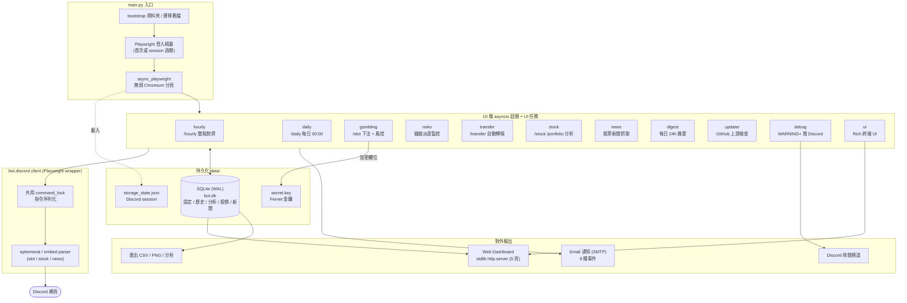

# Discord Auto Bot

> 以 Python + Playwright 驅動無頭 Chromium、自動操作 Discord 斜線指令的自動化機器人;內建 10 條 asyncio 排程迴圈、Rich 終端 UI、自建 `http.server` 即時儀表板,所有狀態以 SQLite + Fernet 加密落地。約 14.5k 行程式碼。

> ⚠️ **服務條款警告(務必先讀)**
> 本專案自動化操作的是**一般使用者帳號(user account)**,而非官方 Bot Token。**自動化使用者帳號明確違反 [Discord 服務條款](https://discord.com/terms)**,可能導致帳號被警告、停權或永久封鎖。
> 本專案**僅供個人學習、技術研究與自動化工程演示之用**。請勿用於任何商業或濫用情境。**使用本軟體所造成的一切後果(包含但不限於帳號處置)由使用者自行承擔,作者不負任何責任。** 若你不接受此風險,請勿執行本程式。


---

## 這是什麼

這是一個跑在 Windows 上的 Discord 自動化工具,核心做法是用 **Playwright 控制一個無頭 Chromium 分頁**,把使用者已登入的 Discord session 載入後,自動送出斜線指令(`/hourly`、`/daily`、`/slot`、`/balance`、`/stock`、`/portfolio`、`/transfer`、`/check` 等)、解析 Discord 回傳的 ephemeral 訊息與 embed,再依設定做後續動作。

它不是單純的腳本,而是一個由 **10 條獨立 asyncio 迴圈**組成的長駐服務:

- **賭博自動化** — 自動下注 `/slot`,支援 `auto` / `fixed` / `kelly` 三種下注策略,以及目標停利、停損下移、連敗冷靜等風控。
- **定時指令** — `/hourly` 整點對齊、`/daily` 每日 00:00 觸發。
- **貓娘派遣監控** — 偵測派遣完成,可選自動「領取並再派遣」。
- **自動轉帳** — 定期 `/transfer` 並自動點確認按鈕。
- **股票監視** — 抓取 `/stock` / `/portfolio` / 做空倉位,做均線交叉、停利停損、波動警示等技術分析(**只給建議,不自動下單**)。
- **股票新聞抓取** — 獨立迴圈定期抓近期新聞,去重後推到 UI 與 email。
- **通知與摘要** — 8 種事件的 email 通知、每日 24 小時摘要、把 `WARNING+` 紀錄推到獨立 Discord 除錯頻道。
- **自我更新** — 定期比對 GitHub 上游 commit,可選自動 `git pull` + 重啟。

操作介面有兩種:**Rich 終端 UI**(單鍵快速鍵 + 互動式設定選單)與**自建 Web Dashboard**(localhost / LAN,5 個頁面)。所有設定、下注歷史、分析統計、股價與新聞都存進 SQLite,敏感欄位(email / dashboard 密碼)以 Fernet 加密。

---

## ✨ 技術亮點

- **10 條 asyncio 迴圈協作**:`hourly` / `daily` / `gambling` / `neko` / `transfer` / `digest` / `updater` / `stock` / `news` / `debug`,加上 `ui` 任務,全部在單一 event loop 上協作排程(見 `main.py`)。
- **共用指令鎖序列化**:所有送指令動作共用一把 `asyncio.Lock`,避免 10 條迴圈同時送指令、互相污染回應解析。
- **獨立頻道架構**:股票 / 新聞 / 貓娘 / 除錯可各自綁定獨立 Discord 頻道;`channel_context` 進入時持鎖 + 切到目標頻道、跑完切回主頻道,降低不同指令的 ephemeral 互相干擾。
- **Ephemeral 累積處理**:Discord ephemeral 訊息在頁面 DOM 上是累加而非替換,parser 以 `rfind` + anchor slice 只解析「最新一則」,避免讀到已賣出 / 已平倉的舊資料。
- **Emoji DOM 解析**:Discord 把 emoji 渲染成 ``,`textContent` 拿不到 alt;自行 walk DOM 把 alt 接出來,否則 slot 符號全是空字串。
- **持久化層(SQLite)**:以 stdlib `sqlite3` + WAL mode 落地設定 / 歷史 / 分析 / 股價 / 新聞;async 介面用 `asyncio.to_thread` 包裝,不阻塞 event loop;啟動時自動把舊版根目錄的 JSON / log 一次性遷移到 `data/` 與 `logs/`。
- **欄位級加密**:email 密碼、dashboard 密碼等敏感字串以 **Fernet(AES-128-CBC + HMAC-SHA256)** 個別加密後存入 SQLite(前綴 `enc:v1:`),未加密欄位仍可直接查詢;若 `cryptography` 套件缺席,退回 stdlib 自製的 AES-CTR-like + HMAC 備援。
- **零依賴 Web Dashboard**:純 Python stdlib `http.server` 實作,**不需 FastAPI / Flask**;含 HTTP Basic Auth(`hmac.compare_digest` 防 timing attack)、CSRF 防護(POST 須 Origin/Referer 與 Host 同源)、log 敏感字遮蔽。
- **下注分析引擎**:EV / 樣本變異數(Bessel n-1 修正)/ 賠率分布 / 符號與線路統計 / 時段分析 / 連勝紀錄,以及 **Kelly 下注**(取 EV 95% 信賴區間下界、半 Kelly、上限 0.25、需 ≥ 200 筆樣本)。另有 hourly filter / rolling EV / trailing stop 三種風控策略與歷史 backtest。
- **可靠性機制**:每條迴圈有 idle/running/ok/failed/auto_paused 健康狀態,連續失敗自動冷卻 30 分鐘;頁面掛掉自動 reload;連續導航失敗刪 session 重新登入並透過 exit code 42 / sentinel 檔讓 `run.bat` 自動重啟整個程式。
- **可被中斷的暫停**:所有長 sleep 切成 0.5 秒分段 `interruptible_sleep`,`P` 鍵可即時暫停 / 恢復所有迴圈。
- **三層除錯管道**:終端 `X` 鍵全螢幕 `WARNING+`、Dashboard `/logs` 頁、推到 Discord 除錯頻道(手機也能看);其中 debug 迴圈自身的失敗 log 會被過濾,避免 feedback loop。

---

## 🏗️ 架構



> 資料流摘要:`main.py` 啟動無頭 Chromium 並載入已登入的 session,接著建立 10 條 asyncio 迴圈與 UI 任務。所有迴圈透過 `bot.discord.client` 的共用指令鎖序列化送指令、解析回應,狀態落地到 SQLite(敏感欄位用 `secret.key` 的 Fernet 加密),再對外輸出到 Web Dashboard、Email、Discord 除錯頻道與匯出檔。

---

## 🚀 快速開始

### 系統需求

- **Windows 10 / 11**(一鍵啟動腳本是 `.bat`;其他作業系統未測試)
- **Python 3.10+**,且已加入 PATH
- 首次安裝需網路下載 Playwright Chromium(約 300 MB)

### 一鍵啟動

雙擊或在終端執行 `run.bat`。腳本會自動偵測狀態並依序處理:

```bat
run.bat
```

`run.bat` 的流程(摘自腳本本身):

1. **沒有 `.venv`** → 自動建立虛擬環境、`pip install -r requirements.txt`、`playwright install chromium`(只跑一次)。
2. **套件缺漏** → 偵測到 `import playwright, rich, qrcode, cryptography` 失敗就重裝。
3. **首次設定** → `main.py` 內的互動式 wizard 引導填入伺服器 / 頻道 / 通知對象等 ID。
4. **首次登入** → 跳出 Chromium 視窗,手動完成 Discord 登入(含 2FA);網址跳到 `/channels/...` 時自動儲存 session。
5. **正常啟動** → 進入 Rich 終端 UI。

之後每次啟動只會跑步驟 5(除非套件變動才重跑步驟 2)。程式請求重啟時(exit code 42 或寫入 `data/.reboot` sentinel),`run.bat` 會自動重新啟動。

### 手動安裝(進階)

若想自行控制環境,可不透過 `run.bat`:

```bash
python -m venv .venv
.venv\Scripts\python.exe -m pip install -r requirements.txt
.venv\Scripts\python.exe -m playwright install chromium
.venv\Scripts\python.exe main.py
```

執行依賴(見 `requirements.txt`):`playwright`、`rich`、`matplotlib`、`qrcode[pil]`、`cryptography`。

### 終端機快速鍵

| 鍵 | 功能 |
|----|------|
| `Q` | 退出 |
| `C` | 修改系統設定(互動式分類選單)|
| `P` | 暫停 / 恢復所有功能 |
| `E` | 匯出賭博紀錄(CSV + PNG + 分析報告 → `exports/`)|
| `S` | 查看 Slot 分析(EV、Kelly、賠率分布、符號 / 線路 / 時段統計)|
| `T` | 查看股票分析(摘要 + 推薦 + 持股 + 做空 + 全部股票 + 新聞)|
| `W` | 在預設瀏覽器開啟 Web Dashboard |
| `K` | 產生並開啟 Dashboard QR Code 圖檔(手機掃描連線)|
| `X` | 全螢幕除錯紀錄(最近 30 筆 `WARNING+`,按 level 上色)|
| `F` | 整個程式重啟 |

### Web Dashboard

啟用後(預設開啟),程式啟動時會在 log 印出本機與 LAN 兩個網址(預設 port `8765`)。5 個頁面:`/` 概覽、`/analysis` 拉霸分析、`/stocks` 股票、`/logs` 即時日誌、`/control` 系統設定。

> **資安提醒**:若要讓同網段手機連線,需把 `dashboard.host` 改為 `0.0.0.0`,此時**務必設定 `dashboard.password`** —— 否則同 WiFi 內任何人都能控制你的 bot。不對外暴露時保持預設 `127.0.0.1` 即可。

---

## 🧪 測試

**尚無自動化測試(待補)。**

目前 repo 內沒有測試套件或 CI 設定。`pyproject.toml` 提供了 [Ruff](https://docs.astral.sh/ruff/) 的 lint / format 設定,可作為基本品質檢查(Ruff 不是執行期依賴,需自行安裝):

```bash
pip install ruff
python -m ruff check .         # 列出 lint 問題
python -m ruff check . --fix   # 自動修可修的
python -m ruff format .        # 格式化
```

---

## ⚠️ 已知限制

- **違反 Discord ToS**:見頁首警告。自動化使用者帳號有實質的封鎖風險,本專案僅供研究 / 學習。
- **Playwright parser 對 Discord 改版脆弱**:所有資料都靠解析 Discord 網頁的 DOM / ephemeral / embed 文字而來。**Discord 一旦改動 UI、selector 或 emoji 渲染方式,解析就可能失效**,需要更新 parser。這是網頁自動化的本質限制,非本專案能完全規避。
- **加密保護有邊界**:Fernet 是對稱加密,金鑰 `data/secret.key` 與密文存在同一台機器上。**金鑰若外洩,加密即失效** —— 它防的是「設定檔被肉眼讀到 / 隨手外流」,不是抵禦有本機存取權限的攻擊者。若 `cryptography` 未安裝會退回較弱的自製備援加密。
- **Kelly / 信賴區間下注是啟發式,非保證**:slot 的長期期望值(EV)是**負的**,任何下注策略都無法把負 EV 變成正 EV。Kelly、95% 信賴區間下界、rolling EV、trailing stop 等只是**風險管理**(降低 variance / drawdown),**不是穩賺或回本的保證**。請勿據此期待獲利。
- **平台限定 Windows**:啟動腳本 `run.bat` 與部分行為(`os.startfile`、`msvcrt` 鍵盤監聽、CP950 編碼處理)綁定 Windows;其他作業系統未測試。
- **股票功能不自動下單**:僅輸出買賣建議訊號,需使用者自行手動操作(Discord 交易 modal 太脆弱,自動下單已移除且不會回來)。
- **單帳號設計**:多帳號需複製整個資料夾並各自使用獨立的 `data/` 與不同的 dashboard port。

---

## 📄 授權與來源

- **授權**:本 repo 目前**未包含 LICENSE 檔**。在作者補上授權條款之前,預設保留所有權利;若你打算重用程式碼,請先聯繫作者確認授權。<!-- TODO: 補上 LICENSE 檔(例如 MIT)後更新此段 -->
- **第三方相依**:本專案使用下列開源套件,各自依其授權條款釋出 —— [Playwright](https://playwright.dev/python/)(Apache-2.0)、[Rich](https://github.com/Textualize/rich)(MIT)、[matplotlib](https://matplotlib.org/)(matplotlib license / PSF-based)、[qrcode](https://github.com/lincolnloop/python-qrcode)(BSD)、[cryptography](https://cryptography.io/)(Apache-2.0 / BSD)。
- **互動對象**:本工具與 Discord 及其上的特定遊戲 / 經濟 bot 互動,但與這些服務**無任何官方關聯**;Discord 為 Discord Inc. 之商標。

---

> 此 README 由程式碼分析重寫,內容均對應 repo 中可驗證的實作。展示用 demo 連結 / 截圖請見下方 accuracy notes 中的待補項目。
